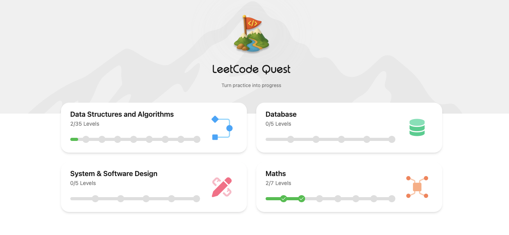

# Leetcode Quest Progress

## Overview



```
Leetcode Quest
|-- Data structure and algorithms leve: 2/35
|   |-- Array 1
|   |   |-- Completed: [Easy] Q1. Concatenation of Array
|   |   |-- Completed: [Easy] Q2. Shuffle the Array
|   |   '-- Completed: [Easy] Q3. Max Consecutive Ones
|   |-- Array 2
|   |   |-- Completed: [Easy] Q1. Set Mismatch
|   |   |-- Completed: [Easy] Q2. How Many Numbers Are Smaller Than the Current Number
|   |   '-- Completed: [Easy] Q3. Find All Numbers Disappeared in an Array
|   '-- Stacks
|       '-- Pending [Med.] Q1. Build an Array With Stack Operations
|
|-- Maths leve: 2/7
|   |-- Arithmetic & Basic Reasoning
|   |   |-- Completed: [Easy] Q1. Can Make Arithmetic Progression From Sequence
|   |   |-- Completed: [Easy] Q2. Find the Pivot Integer
|   |   '-- Completed: [Easy] Q3. Palindrome Number
|   |-- Divisibility & Modular Arithmetic
|   |   |-- Completed: [Easy] Q1. Ugly Number
|   |   |-- Completed: [Med.] Q2. Smallest Integer Divisible by K
|   |   '-- Completed: [Easy] Q3. Self Dividing Numbers
|   |-- Combination and Permutation Module Library
|       '-- Pending [Hard] Q1. Permutation Sequence
|
|-- Database
|   |-- SQL 1
|       '-- Completed: [Easy] Q1. Combine Two Tables
|
|-- System & Software Design
    '-- Cache System Design Base**
```
